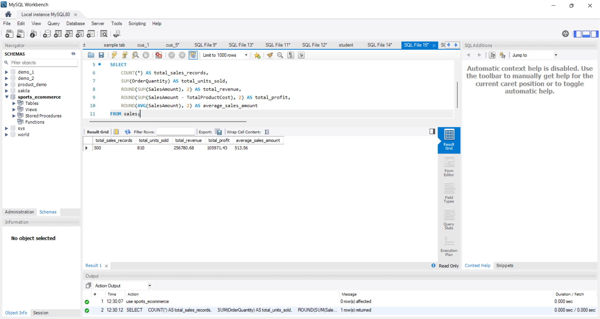
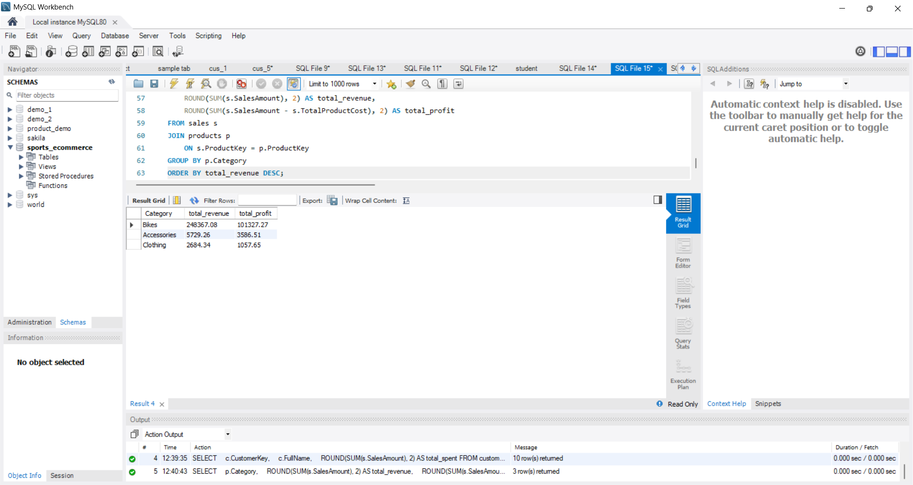

# Sports E-Commerce Sales & Customer Analytics Using MySQL

## Project Overview

This project analyzes a sporting-goods e-commerce dataset using **MySQL**.

The goal is to transform raw customer, product, and sales data into meaningful business insights using SQL.

The project covers customer behavior, product performance, revenue, profitability, sales trends, and category performance.

The analysis includes **40 business questions** organized into Beginner, Intermediate, and Advanced SQL levels.

---

## Business Objectives

The main objectives of this project are to:

- Analyze overall sales and revenue performance
- Identify the best-performing products
- Analyze customer spending behavior
- Compare product categories
- Calculate revenue and profit
- Identify high-value customers
- Analyze monthly sales performance
- Rank products using SQL window functions
- Calculate product contribution to total revenue
- Demonstrate practical SQL skills for business analytics

---

## Database Structure

The project uses three main relational tables:

### 1. Customers

Contains customer information.

Important columns include:

- `CustomerKey` — Primary Key
- `FirstName`
- `LastName`
- `FullName`
- `BirthDate`
- `MaritalStatus`
- `Gender`
- `YearlyIncome`
- `TotalChildren`
- `Education`
- `Occupation`
- `CustomerCity`
- `CustomerState`
- `CustomerCountry`
- `DateFirstPurchase`

### 2. Products

Contains product information.

Important columns include:

- `ProductKey` — Primary Key
- `ProductName`
- `SubCategory`
- `Category`
- `StandardCost`
- `Color`
- `ListPrice`
- `DaysToManufacture`
- `ProductLine`
- `ModelName`
- `ProductDescription`
- `StartDate`

### 3. Sales

Contains sales transaction information.

Important columns include:

- `SalesID` — Primary Key
- `ProductKey` — Foreign Key
- `CustomerKey` — Foreign Key
- `OrderDate`
- `ShipDate`
- `SalesOrderNumber`
- `SalesOrderLineNumber`
- `OrderQuantity`
- `UnitPrice`
- `TotalProductCost`
- `SalesAmount`
- `TaxAmt`

---

## Entity Relationship Diagram

The database relationships are:

```text
customers
    │
    │ CustomerKey
    ▼
sales
    │
    │ ProductKey
    ▼
products:


``` 

## 📸 Sample Query Outputs

### 1. Overall Sales Performance

```sql
SELECT
    COUNT(*) AS total_sales_records,
    SUM(OrderQuantity) AS total_units_sold,
    ROUND(SUM(SalesAmount), 2) AS total_revenue,
    ROUND(SUM(SalesAmount - TotalProductCost), 2) AS total_profit,
    ROUND(AVG(SalesAmount), 2) AS average_sales_amount
FROM sales;




SELECT
    p.ProductName,
    ROUND(SUM(s.SalesAmount), 2) AS total_revenue
FROM sales s
JOIN products p
    ON s.ProductKey = p.ProductKey
GROUP BY p.ProductKey, p.ProductName
ORDER BY total_revenue DESC
LIMIT 10;


SELECT
    c.CustomerKey,
    c.FullName,
    ROUND(SUM(s.SalesAmount), 2) AS total_spent
FROM customers c
JOIN sales s
    ON c.CustomerKey = s.CustomerKey
GROUP BY c.CustomerKey, c.FullName
ORDER BY total_spent DESC
LIMIT 10;


SELECT
    p.Category,
    ROUND(SUM(s.SalesAmount), 2) AS total_revenue,
    ROUND(SUM(s.SalesAmount - s.TotalProductCost), 2) AS total_profit
FROM sales s
JOIN products p
    ON s.ProductKey = p.ProductKey
GROUP BY p.Category
ORDER BY total_revenue DESC;




WITH product_ranking AS
(
    SELECT
        p.Category,
        p.ProductKey,
        p.ProductName,
        ROUND(SUM(s.SalesAmount), 2) AS total_revenue,
        RANK() OVER (
            PARTITION BY p.Category
            ORDER BY SUM(s.SalesAmount) DESC
        ) AS category_rank
    FROM products p
    JOIN sales s
        ON p.ProductKey = s.ProductKey
    GROUP BY p.Category, p.ProductKey, p.ProductName
)
SELECT
    Category,
    ProductKey,
    ProductName,
    total_revenue,
    category_rank
FROM product_ranking
WHERE category_rank <= 3
ORDER BY Category, category_rank;


