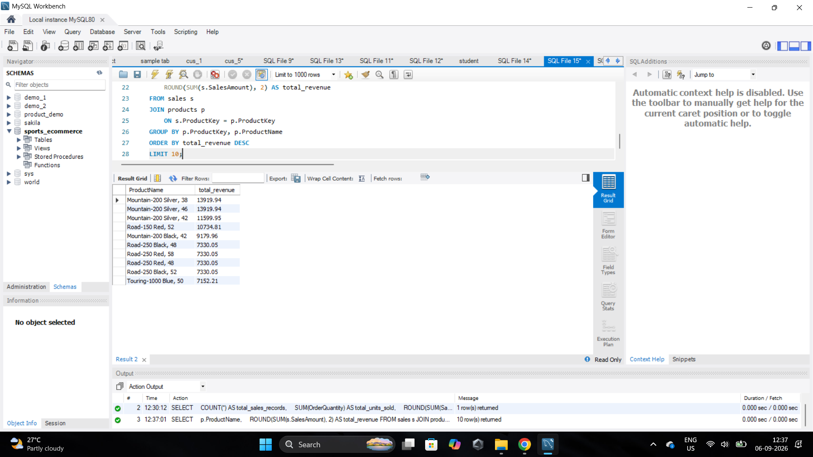
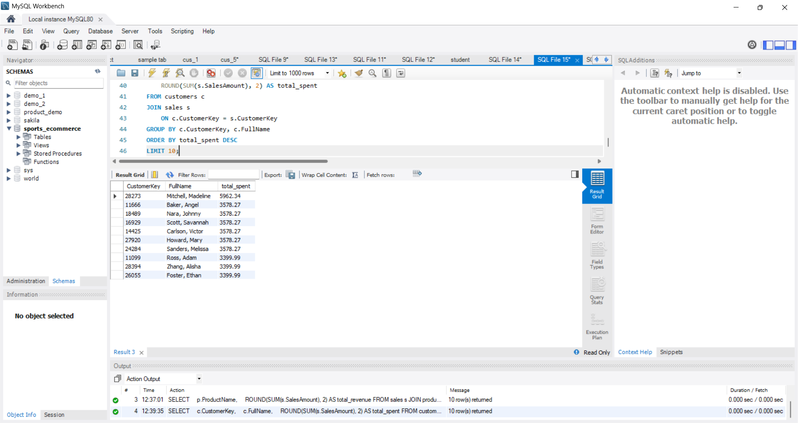

# Sports E-Commerce Sales & Customer Analytics Using MySQL

## 📌 Project Overview

This project analyzes a sporting-goods e-commerce dataset using
**MySQL**.

The goal is to transform customer, product, and sales data into
meaningful business insights using SQL.

The project covers:

-   Customer behavior
-   Product performance
-   Revenue and profitability
-   Sales trends
-   Category and subcategory performance
-   High-value customers
-   Product ranking
-   Revenue contribution analysis

The project contains **40 business questions** organized into three SQL
levels:

-   **Beginner --- 20 queries**
-   **Intermediate --- 10 queries**
-   **Advanced --- 10 queries**

------------------------------------------------------------------------

## 🎯 Business Objectives

The main objectives of this project are to:

-   Analyze overall sales and revenue performance
-   Identify the best-performing products
-   Analyze customer spending behavior
-   Compare product categories and subcategories
-   Calculate revenue and profit
-   Identify high-value customers
-   Analyze monthly sales performance
-   Rank products using SQL window functions
-   Calculate product contribution to total revenue
-   Use CTEs, subqueries, views, and stored procedures
-   Demonstrate practical SQL skills for business analytics

------------------------------------------------------------------------

## 🗄️ Database Structure

The project uses three main relational tables:

### 1. Customers

Contains customer information.

**Important columns:**

  Column                Description
  --------------------- ------------------------
  `CustomerKey`         Primary Key
  `FirstName`           Customer first name
  `LastName`            Customer last name
  `FullName`            Customer full name
  `BirthDate`           Customer birth date
  `MaritalStatus`       Marital status
  `Gender`              Customer gender
  `YearlyIncome`        Yearly income
  `TotalChildren`       Number of children
  `Education`           Education level
  `Occupation`          Occupation
  `CustomerCity`        Customer city
  `CustomerState`       Customer state
  `CustomerCountry`     Customer country
  `DateFirstPurchase`   Date of first purchase

### 2. Products

Contains product information.

**Important columns:**

  Column                 Description
  ---------------------- -----------------------
  `ProductKey`           Primary Key
  `ProductName`          Product name
  `SubCategory`          Product subcategory
  `Category`             Product category
  `StandardCost`         Standard product cost
  `Color`                Product color
  `ListPrice`            Product list price
  `DaysToManufacture`    Manufacturing time
  `ProductLine`          Product line
  `ModelName`            Product model
  `ProductDescription`   Product description
  `StartDate`            Product start date

### 3. Sales

Contains sales transaction information.

**Important columns:**

  Column                   Description
  ------------------------ ---------------------------------------
  `SalesID`                Primary Key
  `ProductKey`             Foreign Key → `products.ProductKey`
  `CustomerKey`            Foreign Key → `customers.CustomerKey`
  `OrderDate`              Order date
  `ShipDate`               Shipping date
  `SalesOrderNumber`       Sales order number
  `SalesOrderLineNumber`   Sales order line number
  `OrderQuantity`          Quantity ordered
  `UnitPrice`              Unit selling price
  `TotalProductCost`       Total product cost
  `SalesAmount`            Sales/revenue amount
  `TaxAmt`                 Tax amount

------------------------------------------------------------------------

## 🔗 Entity Relationship Diagram

The database follows a simple relational structure:

``` text
customers
    │
    │ CustomerKey
    ▼
  sales
    │
    │ ProductKey
    ▼
 products
```

### Relationships

``` text
customers.CustomerKey
        │
        └──────────────► sales.CustomerKey

products.ProductKey
        │
        └──────────────► sales.ProductKey
```

-   One customer can have multiple sales records.
-   One product can appear in multiple sales records.
-   The `sales` table connects customers and products.

------------------------------------------------------------------------

## 📁 Project Structure

``` text
sports-ecommerce-sql/
│
├── sql/
│   ├── 01_beginner.sql
│   ├── 02_intermediate.sql
│   └── 03_advanced.sql
│
├── screenshots/
│   ├── 01_overall_sales_performance.png
│   ├── 02_top_products.png
│   ├── 03_top_customers.png
│   ├── 04_category_performance.png
│   └── ...
│
├── README.md
└── ...
```

------------------------------------------------------------------------

## 🧠 SQL Skills Covered

### Beginner SQL

The beginner section focuses on fundamental SQL concepts:

-   `SELECT`
-   `COUNT()`
-   `SUM()`
-   `AVG()`
-   `MIN()`
-   `MAX()`
-   `DISTINCT`
-   `GROUP BY`
-   `ORDER BY`
-   `LIMIT`
-   Basic `JOIN`

### Intermediate SQL

The intermediate section focuses on business analysis:

-   `HAVING`
-   Aggregations
-   Revenue analysis
-   Profit analysis
-   Customer analysis
-   Product analysis
-   Category and subcategory analysis
-   Order-level analysis
-   Monthly sales analysis

### Advanced SQL

The advanced section demonstrates:

-   Subqueries
-   Common Table Expressions (CTEs)
-   Window functions
-   `RANK()`
-   `ROW_NUMBER()`
-   Revenue contribution
-   Product ranking
-   Views
-   Stored procedures
-   Advanced business analysis

------------------------------------------------------------------------

# 📊 Sample Query Outputs

## 1. Overall Sales Performance

``` sql
SELECT
    COUNT(*) AS total_sales_records,
    SUM(OrderQuantity) AS total_units_sold,
    ROUND(SUM(SalesAmount), 2) AS total_revenue,
    ROUND(SUM(SalesAmount - TotalProductCost), 2) AS total_profit,
    ROUND(AVG(SalesAmount), 2) AS average_sales_amount
FROM sales;
```


------------------------------------------------------------------------

## 2. Top 10 Products by Revenue

``` sql
SELECT
    p.ProductName,
    ROUND(SUM(s.SalesAmount), 2) AS total_revenue
FROM sales s
JOIN products p
    ON s.ProductKey = p.ProductKey
GROUP BY
    p.ProductKey,
    p.ProductName
ORDER BY total_revenue DESC
LIMIT 10;
```



------------------------------------------------------------------------

## 3. Top 10 Customers by Spending

``` sql
SELECT
    c.CustomerKey,
    c.FullName,
    ROUND(SUM(s.SalesAmount), 2) AS total_spent
FROM customers c
JOIN sales s
    ON c.CustomerKey = s.CustomerKey
GROUP BY
    c.CustomerKey,
    c.FullName
ORDER BY total_spent DESC
LIMIT 10;
```



------------------------------------------------------------------------

## 4. Category Performance

``` sql
SELECT
    p.Category,
    ROUND(SUM(s.SalesAmount), 2) AS total_revenue,
    ROUND(SUM(s.SalesAmount - s.TotalProductCost), 2) AS total_profit
FROM sales s
JOIN products p
    ON s.ProductKey = p.ProductKey
GROUP BY p.Category
ORDER BY total_revenue DESC;
```


------------------------------------------------------------------------

## 5. Top 3 Products by Revenue in Each Category

``` sql
WITH product_ranking AS
(
    SELECT
        p.Category,
        p.ProductKey,
        p.ProductName,
        ROUND(SUM(s.SalesAmount), 2) AS total_revenue,
        ROW_NUMBER() OVER (
            PARTITION BY p.Category
            ORDER BY SUM(s.SalesAmount) DESC
        ) AS category_rank
    FROM products p
    JOIN sales s
        ON p.ProductKey = s.ProductKey
    GROUP BY
        p.Category,
        p.ProductKey,
        p.ProductName
)
SELECT
    Category,
    ProductKey,
    ProductName,
    total_revenue,
    category_rank
FROM product_ranking
WHERE category_rank <= 3
ORDER BY
    Category,
    category_rank;
```


> **Note:** `ROW_NUMBER()` is used when the requirement is to return
> exactly three products per category. If tied rankings should all be
> included, `RANK()` can be used instead.

------------------------------------------------------------------------

## 📈 Key Business Analysis Areas

The 40 SQL questions analyze several important business areas:

### Sales Analysis

-   Total sales records
-   Total units sold
-   Total revenue
-   Average sales amount
-   Monthly sales performance

### Product Analysis

-   Most expensive products
-   Best-selling products
-   Top revenue-generating products
-   Product profitability
-   Category performance
-   Subcategory performance

### Customer Analysis

-   Total customers
-   Customer spending
-   Highest-value customers
-   Customer purchase frequency
-   Average customer spending

### Profitability Analysis

``` text
Profit = Sales Amount - Total Product Cost
```

The project uses this calculation to evaluate product, category, and
overall profitability.

### Advanced Analysis

-   Ranking products within categories
-   Top products by revenue
-   Revenue contribution
-   CTE-based analysis
-   Window functions
-   Views
-   Stored procedures

------------------------------------------------------------------------

## 🛠️ Tools & Technologies

  Tool                  Purpose
  --------------------- ---------------------------------------
  **MySQL**             Database and SQL analysis
  **MySQL Workbench**   SQL development and execution
  **GitHub**            Project version control and portfolio
  **SQL**               Data analysis and business insights

------------------------------------------------------------------------

## ▶️ How to Run the Project

### Step 1 --- Create the database

Create a MySQL database for the project.

``` sql
CREATE DATABASE sports_ecommerce;
USE sports_ecommerce;
```

### Step 2 --- Create the tables

Create the `customers`, `products`, and `sales` tables and load the
dataset.

### Step 3 --- Run the SQL files

Run the files in this order:

``` text
01_beginner.sql
02_intermediate.sql
03_advanced.sql
```

### Step 4 --- Execute the queries

Each SQL file contains business questions followed by the corresponding
SQL queries.

For the stored procedure in the advanced section, create the procedure
first and then execute it with:

``` sql
CALL GetCustomerSales(11037);
```

------------------------------------------------------------------------

## 📂 SQL Files

### `01_beginner.sql`

Contains **20 beginner-level business questions** covering fundamental
SQL concepts and basic business analysis.

### `02_intermediate.sql`

Contains **10 intermediate-level business questions** covering
aggregations, profitability, customer analysis, order analysis, and
sales trends.

### `03_advanced.sql`

Contains **10 advanced-level business questions** covering:

-   Subqueries
-   CTEs
-   Window functions
-   Ranking
-   Revenue contribution
-   Views
-   Stored procedures

------------------------------------------------------------------------

## 📌 Project Highlights

This project demonstrates the ability to:

-   Work with relational databases
-   Understand primary and foreign key relationships
-   Write SQL queries for business problems
-   Perform aggregation and grouping
-   Use joins across multiple tables
-   Analyze customers and products
-   Calculate revenue and profit
-   Use window functions for ranking
-   Build CTE-based queries
-   Create SQL views
-   Create and execute stored procedures
-   Present SQL analysis through GitHub

------------------------------------------------------------------------

## 👨‍💻 Author

**Nandhakrishnan**

GitHub: [nandhakrishnan22](https://github.com/nandhakrishnan22)

------------------------------------------------------------------------

## ⭐ Conclusion

The **Sports E-Commerce Sales & Customer Analytics** project
demonstrates practical MySQL skills through 40 business-focused SQL
questions.

It progresses from fundamental SQL queries to advanced analytical
techniques such as CTEs, window functions, ranking, views, and stored
procedures.

The project provides a practical example of how SQL can be used to
convert e-commerce sales data into meaningful business insights.
